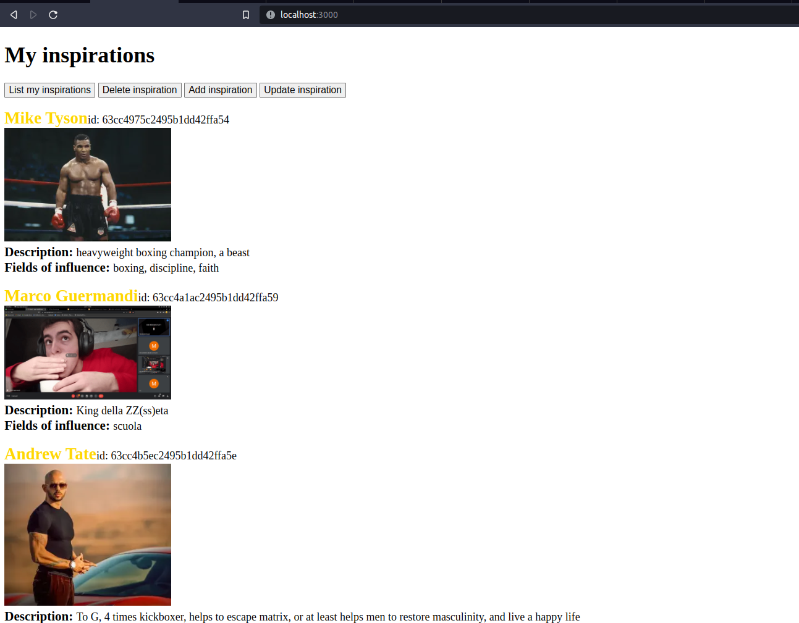
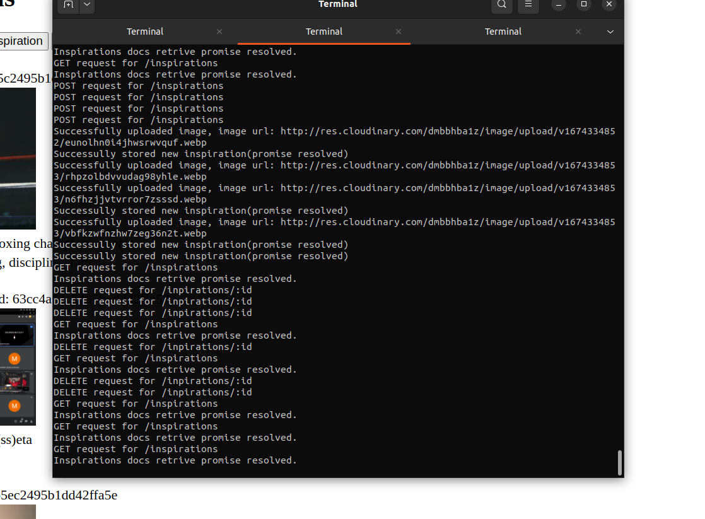
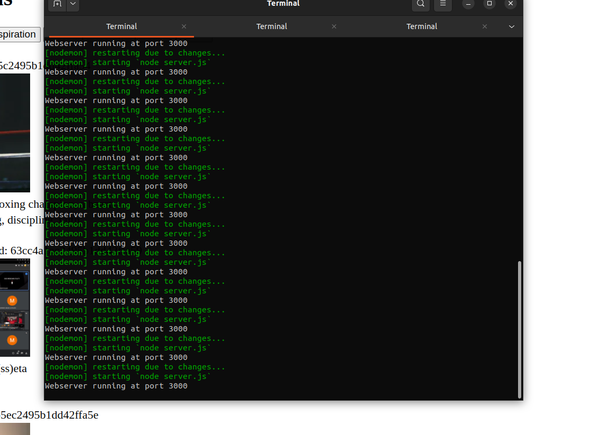

# Inspirations list project
## You can add a list with all your inspirations also adding an image for the.

### webapp view

## Backend
Architecture of the web app: 1 server to serve/render the frontend, 1 server for the api, then the frontend communicates with the api using AJAX.

### api requests view, and stuff that happens

### webserver terminal view
